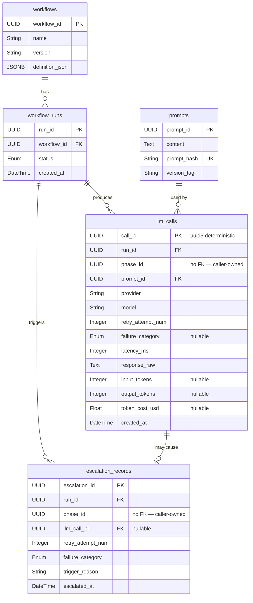
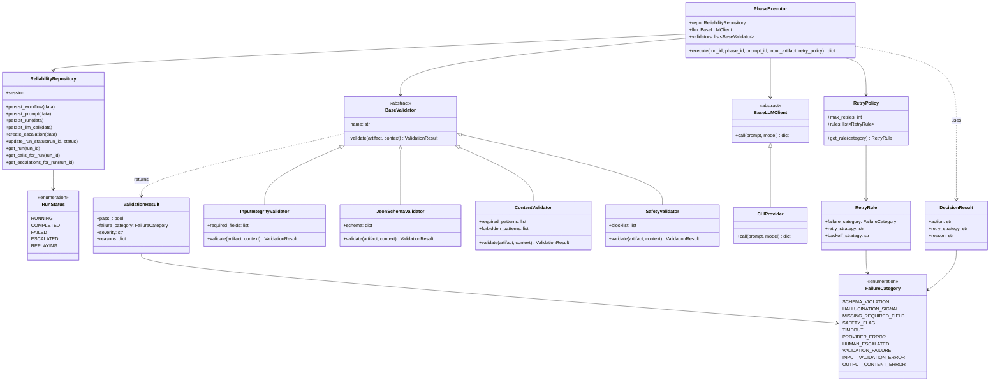
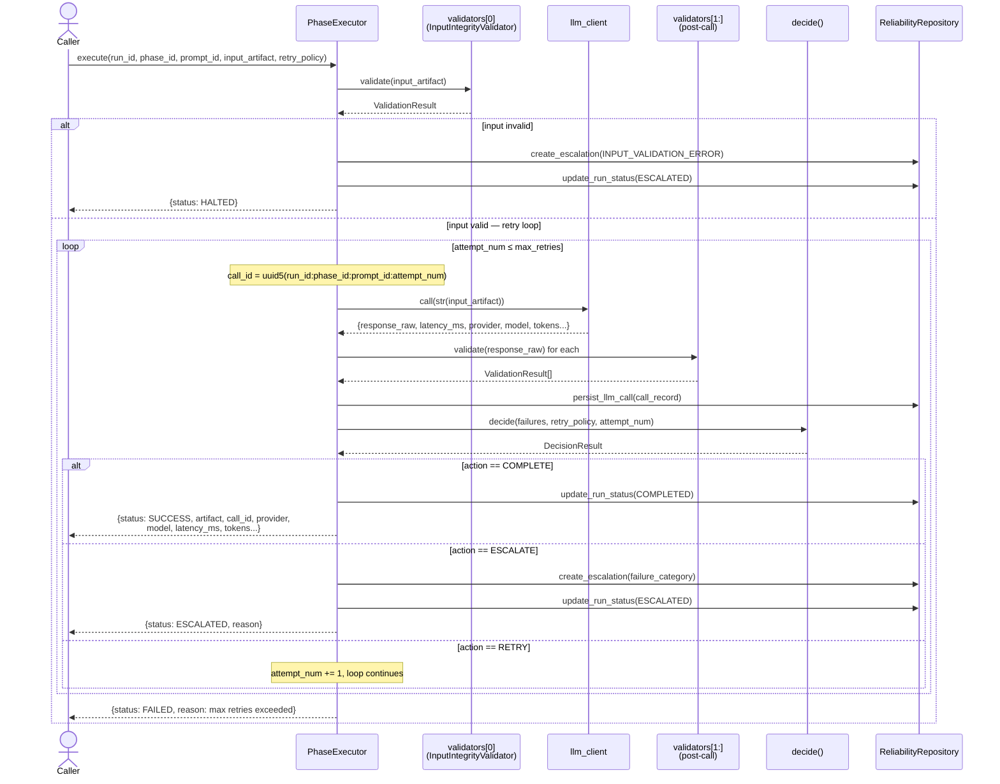
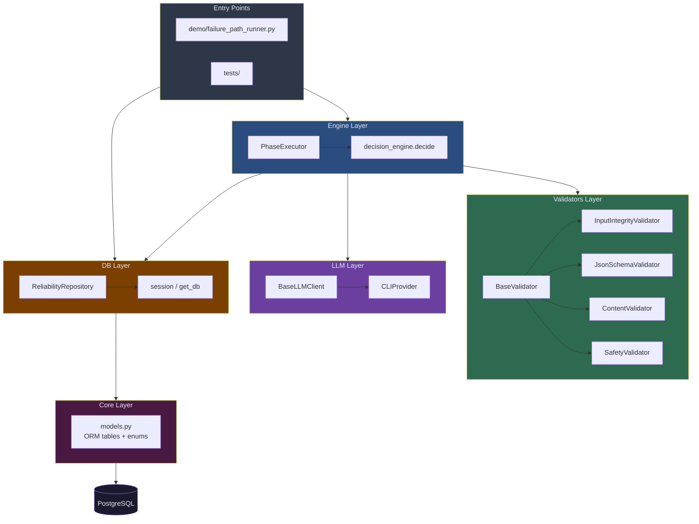
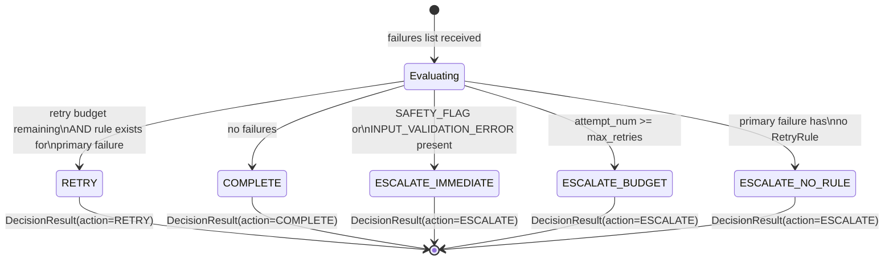

# ai-reliability-fw — Diagrams

---

## 1. Entity-Relationship Diagram (Database Schema)

---

## 2. Class Diagram (Domain Model)

---

## 3. Sequence Diagram (PhaseExecutor.execute — all paths)

---

## 4. Component / Layer Diagram

---

## 5. Decision Engine State Machine

