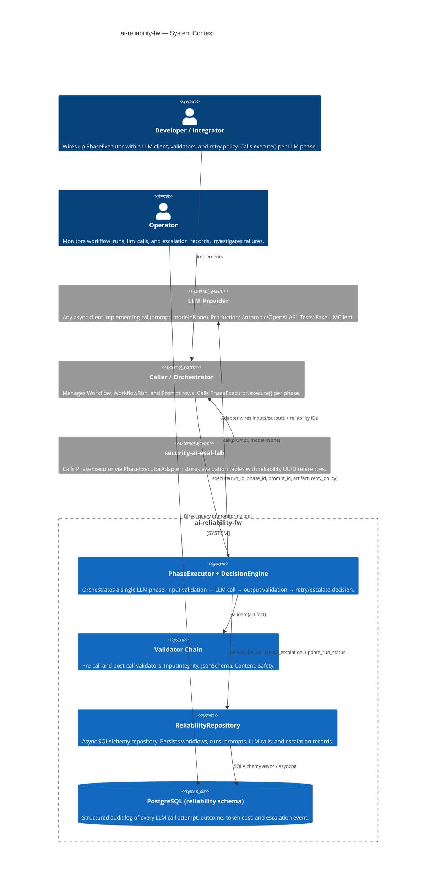

# System Context Diagram

`ai-reliability-fw` is a Python library/framework that wraps any async LLM client
with structured validation, retry logic, escalation handling, and full DB persistence.
It is consumed by `/lump/apps/security-ai-eval-lab` as the LLM execution control plane.

