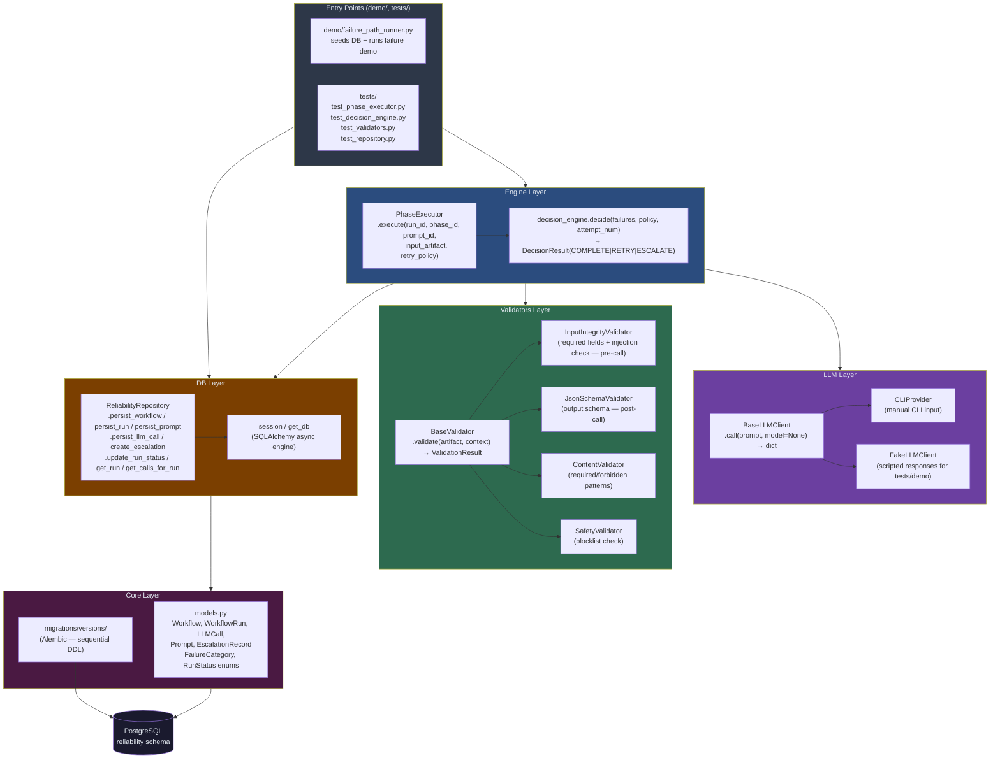

# Layer Architecture (ADR-0003)

Six-layer unidirectional architecture. Dependencies only flow downward — no layer may import from a layer above it.

```mermaid
flowchart TD
    subgraph Entry["Entry Points (demo/, tests/)"]
        DEMO["demo/failure_path_runner.py\nseeds DB + runs failure demo"]
        TESTS["tests/\ntest_phase_executor.py\ntest_decision_engine.py\ntest_validators.py\ntest_repository.py"]
    end

    subgraph Engine["Engine Layer"]
        PE["PhaseExecutor\n.execute(run_id, phase_id, prompt_id,\n        input_artifact, retry_policy)"]
        DE["decision_engine.decide(failures, policy, attempt_num)\n→ DecisionResult(COMPLETE|RETRY|ESCALATE)"]
        PE --> DE
    end

    subgraph LLM["LLM Layer"]
        BLC["BaseLLMClient\n.call(prompt, model=None) → dict"]
        CLI["CLIProvider\n(manual CLI input)"]
        FAKE["FakeLLMClient\n(scripted responses for tests/demo)"]
        BLC --> CLI
        BLC --> FAKE
    end

    subgraph Validators["Validators Layer"]
        BV["BaseValidator\n.validate(artifact, context) → ValidationResult"]
        IIV["InputIntegrityValidator\n(required fields)"]
        IIV["InputIntegrityValidator\n(required fields + injection check — pre-call)"]
        JSV["JsonSchemaValidator\n(output schema — post-call)"]
        CV["ContentValidator\n(required/forbidden patterns)"]
        SV["SafetyValidator\n(blocklist check)"]
        BV --> IIV & JSV & CV & SV
    end

    subgraph DB["DB Layer"]
        RR["ReliabilityRepository\n.persist_workflow / persist_run / persist_prompt\n.persist_llm_call / create_escalation\n.update_run_status / get_run / get_calls_for_run"]
        SES["session / get_db\n(SQLAlchemy async engine)"]
        RR --> SES
    end

    subgraph Core["Core Layer"]
        MOD["models.py\nWorkflow, WorkflowRun, LLMCall,\nPrompt, EscalationRecord\nFailureCategory, RunStatus enums"]
        MIGS["migrations/versions/\n(Alembic — sequential DDL)"]
    end

    INFRA[("PostgreSQL\nreliability schema")]

    Entry --> Engine
    Entry --> DB
    Engine --> Validators
    Engine --> LLM
    Engine --> DB
    DB --> Core
    Core --> INFRA
    MIGS --> INFRA

    style Entry fill:#2d3748,color:#e2e8f0
    style Engine fill:#2b4c7e,color:#e2e8f0
    style LLM fill:#6b3fa0,color:#e2e8f0
    style Validators fill:#2d6a4f,color:#e2e8f0
    style DB fill:#7b3f00,color:#e2e8f0
    style Core fill:#4a1942,color:#e2e8f0
    style INFRA fill:#1a1a2e,color:#e2e8f0
```
