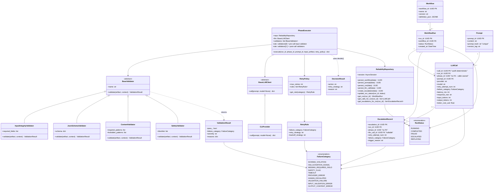

# Class Diagram — Domain Model and Engine

```mermaid
classDiagram

    %% ── Enums ────────────────────────────────────────────────
    class FailureCategory {
        <<enumeration>>
        SCHEMA_VIOLATION
        HALLUCINATION_SIGNAL
        MISSING_REQUIRED_FIELD
        SAFETY_FLAG
        TIMEOUT
        PROVIDER_ERROR
        HUMAN_ESCALATED
        VALIDATION_FAILURE
        INPUT_VALIDATION_ERROR
        OUTPUT_CONTENT_ERROR
    }

    class RunStatus {
        <<enumeration>>
        RUNNING
        COMPLETED
        FAILED
        ESCALATED
        REPLAYING
    }

    %% ── Validators ───────────────────────────────────────────
    class BaseValidator {
        <<abstract>>
        +name: str
        +validate(artifact, context) ValidationResult
    }

    class ValidationResult {
        +pass_: bool
        +failure_category: FailureCategory
        +severity: str
        +reasons: dict
    }

    class InputIntegrityValidator {
        +required_fields: list
        +validate(artifact, context) ValidationResult
    }

    class JsonSchemaValidator {
        +schema: dict
        +validate(artifact, context) ValidationResult
    }

    class ContentValidator {
        +required_patterns: list
        +forbidden_patterns: list
        +validate(artifact, context) ValidationResult
    }

    class SafetyValidator {
        +blocklist: list
        +validate(artifact, context) ValidationResult
    }

    BaseValidator <|-- InputIntegrityValidator
    BaseValidator <|-- JsonSchemaValidator
    BaseValidator <|-- ContentValidator
    BaseValidator <|-- SafetyValidator
    BaseValidator ..> ValidationResult : returns
    ValidationResult --> FailureCategory

    %% ── LLM Clients ──────────────────────────────────────────
    class BaseLLMClient {
        <<abstract>>
        +call(prompt, model=None) dict
    }

    class CLIProvider {
        +call(prompt, model=None) dict
    }

    BaseLLMClient <|-- CLIProvider

    %% ── Decision Engine ──────────────────────────────────────
    class RetryRule {
        +failure_category: FailureCategory
        +retry_strategy: str
        +backoff_strategy: str
    }

    class RetryPolicy {
        +max_retries: int
        +rules: list~RetryRule~
        +get_rule(category) RetryRule
    }

    class DecisionResult {
        +action: str
        +retry_strategy: str
        +reason: str
    }

    RetryPolicy --> RetryRule
    RetryRule --> FailureCategory

    %% ── Engine ───────────────────────────────────────────────
    class PhaseExecutor {
        +repo: ReliabilityRepository
        +llm: BaseLLMClient
        +validators: list~BaseValidator~
        +execute(run_id, phase_id, prompt_id, input_artifact, retry_policy) dict
        note: validators[0] = pre-call input validator
        note: validators[1:] = post-call validators
    }

    PhaseExecutor --> BaseValidator
    PhaseExecutor --> BaseLLMClient
    PhaseExecutor --> RetryPolicy
    PhaseExecutor ..> DecisionResult : uses decide()

    %% ── Repository ───────────────────────────────────────────
    class ReliabilityRepository {
        +session: AsyncSession
        +persist_workflow(data) UUID
        +persist_prompt(data) UUID
        +persist_run(data) UUID
        +persist_llm_call(data) UUID
        +create_escalation(data) UUID
        +update_run_status(run_id, status)
        +get_run(run_id) WorkflowRun
        +get_calls_for_run(run_id) list~LLMCall~
        +get_escalations_for_run(run_id) list~EscalationRecord~
    }

    PhaseExecutor --> ReliabilityRepository
    ReliabilityRepository --> RunStatus

    %% ── ORM Models ───────────────────────────────────────────
    class Workflow {
        +workflow_id: UUID PK
        +name: str
        +version: str
        +definition_json: JSONB
    }

    class WorkflowRun {
        +run_id: UUID PK
        +workflow_id: UUID FK
        +status: RunStatus
        +created_at: DateTime
    }

    class LLMCall {
        +call_id: UUID PK "uuid5 deterministic"
        +run_id: UUID FK
        +phase_id: UUID "no FK - caller-owned"
        +prompt_id: UUID FK
        +provider: str
        +model: str
        +retry_attempt_num: int
        +failure_category: FailureCategory
        +latency_ms: int
        +response_raw: str
        +input_tokens: int
        +output_tokens: int
        +token_cost_usd: float
    }

    class Prompt {
        +prompt_id: UUID PK
        +content: str
        +prompt_hash: str "unique"
        +version_tag: str
    }

    class EscalationRecord {
        +escalation_id: UUID PK
        +run_id: UUID FK
        +phase_id: UUID "no FK"
        +llm_call_id: UUID FK "nullable"
        +retry_attempt_num: int
        +failure_category: FailureCategory
        +trigger_reason: str
    }

    Workflow "1" --> "0..*" WorkflowRun
    WorkflowRun "1" --> "0..*" LLMCall
    WorkflowRun "1" --> "0..*" EscalationRecord
    Prompt "1" --> "0..*" LLMCall
    LLMCall "0..1" --> "0..1" EscalationRecord
    WorkflowRun --> RunStatus
    LLMCall --> FailureCategory
    EscalationRecord --> FailureCategory
```
