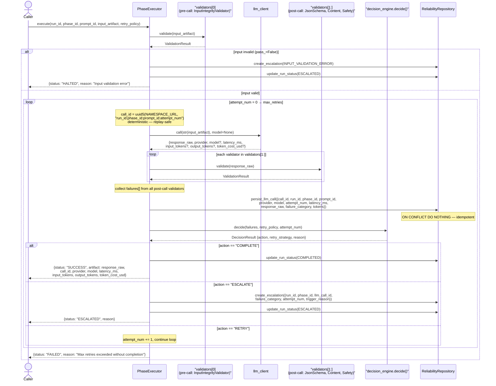

# Sequence Diagram — PhaseExecutor.execute() (all paths)

```mermaid
sequenceDiagram
    actor Caller
    participant PE as PhaseExecutor
    participant V0 as "validators[0]<br/>(pre-call: InputIntegrityValidator)"
    participant LLM as llm_client
    participant Vn as "validators[1:]<br/>(post-call: JsonSchema, Content, Safety)"
    participant DE as "decision_engine.decide()"
    participant DB as ReliabilityRepository

    Caller->>PE: execute(run_id, phase_id, prompt_id, input_artifact, retry_policy)

    PE->>V0: validate(input_artifact)
    V0-->>PE: ValidationResult

    alt input invalid (pass_=False)
        PE->>DB: create_escalation(INPUT_VALIDATION_ERROR)
        PE->>DB: update_run_status(ESCALATED)
        PE-->>Caller: {status: "HALTED", reason: "Input validation error"}
    else input valid
        loop attempt_num = 0 → max_retries
            Note over PE: call_id = uuid5(NAMESPACE_URL,<br/>"run_id:phase_id:prompt_id:attempt_num")<br/>deterministic — replay-safe

            PE->>LLM: call(str(input_artifact), model=None)
            LLM-->>PE: {response_raw, provider, model?, latency_ms,<br/>input_tokens?, output_tokens?, token_cost_usd?}

            loop each validator in validators[1:]
                PE->>Vn: validate(response_raw)
                Vn-->>PE: ValidationResult
            end
            Note over PE: collect failures[] from all post-call validators

            PE->>DB: persist_llm_call({call_id, run_id, phase_id, prompt_id,<br/>provider, model, attempt_num, latency_ms,<br/>response_raw, failure_category, tokens})
            Note over DB: ON CONFLICT DO NOTHING — idempotent

            PE->>DE: decide(failures, retry_policy, attempt_num)
            DE-->>PE: DecisionResult {action, retry_strategy, reason}

            alt action == "COMPLETE"
                PE->>DB: update_run_status(COMPLETED)
                PE-->>Caller: {status: "SUCCESS", artifact: response_raw,<br/>call_id, provider, model, latency_ms,<br/>input_tokens, output_tokens, token_cost_usd}
            else action == "ESCALATE"
                PE->>DB: create_escalation({run_id, phase_id, llm_call_id,<br/>failure_category, attempt_num, trigger_reason})
                PE->>DB: update_run_status(ESCALATED)
                PE-->>Caller: {status: "ESCALATED", reason}
            else action == "RETRY"
                Note over PE: attempt_num += 1, continue loop
            end
        end

        PE-->>Caller: {status: "FAILED", reason: "Max retries exceeded without completion"}
    end
```
