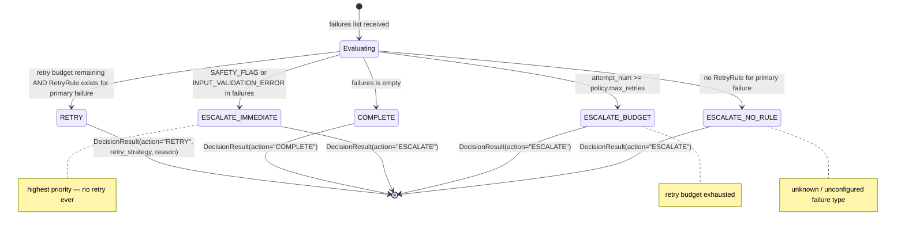
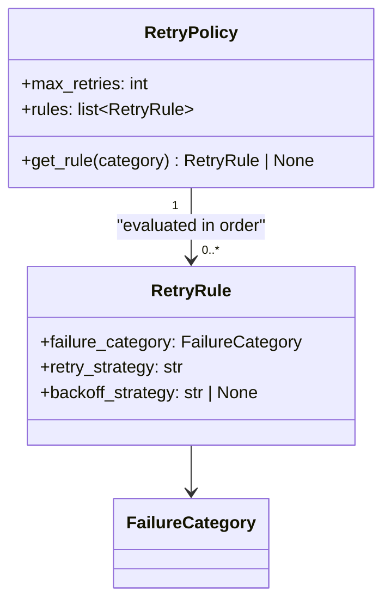

# Decision Engine — State Machine and Logic

The `decide()` function is a **pure function** (no I/O, no side effects). It takes a list
of `FailureCategory` values, a `RetryPolicy`, and the current attempt number, and returns
a `DecisionResult` with action `COMPLETE`, `RETRY`, or `ESCALATE`.

## State Machine



## Decision Logic Flowchart

```mermaid
flowchart TD
    START(["decide(failures, policy, attempt_num)"])
    CHECK_EMPTY{failures empty?}
    CHECK_CRITICAL{"SAFETY_FLAG or\nINPUT_VALIDATION_ERROR\nin failures?"}
    CHECK_BUDGET{attempt_num >= max_retries?}
    CHECK_RULE{RetryRule exists for\nfailures[0]?}

    COMPLETE["DecisionResult(COMPLETE)\n'No failures detected'"]
    ESC_CRIT["DecisionResult(ESCALATE)\n'Critical failure: {category}'"]
    ESC_BUDGET["DecisionResult(ESCALATE)\n'Retries exhausted ({attempt_num})'"]
    ESC_NORULE["DecisionResult(ESCALATE)\n'No retry rule for {category}'"]
    RETRY["DecisionResult(RETRY)\nretry_strategy = rule.retry_strategy\n'Retrying {category} using {strategy}'"]

    START --> CHECK_EMPTY
    CHECK_EMPTY -->|yes| COMPLETE
    CHECK_EMPTY -->|no| CHECK_CRITICAL
    CHECK_CRITICAL -->|yes| ESC_CRIT
    CHECK_CRITICAL -->|no| CHECK_BUDGET
    CHECK_BUDGET -->|yes| ESC_BUDGET
    CHECK_BUDGET -->|no| CHECK_RULE
    CHECK_RULE -->|no| ESC_NORULE
    CHECK_RULE -->|yes| RETRY

    style COMPLETE fill:#1a4a3a,color:#e2e8f0
    style ESC_CRIT fill:#4a1a1a,color:#e2e8f0
    style ESC_BUDGET fill:#4a1a1a,color:#e2e8f0
    style ESC_NORULE fill:#4a1a1a,color:#e2e8f0
    style RETRY fill:#1a365d,color:#e2e8f0
```

## RetryPolicy Structure


