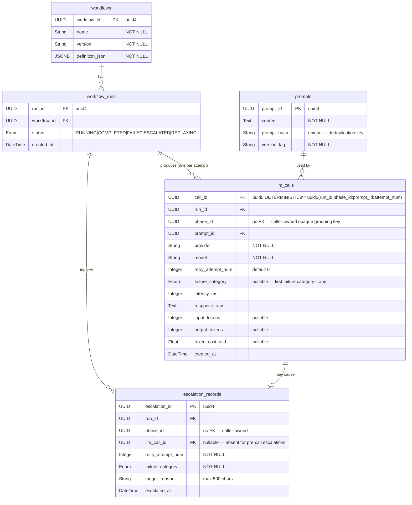

# Database Schema — ER Diagram

PostgreSQL `reliability` schema. All tables use `reliability.` as the schema prefix.

## Key Schema Decisions

| Decision | ADR | Rationale |
|---|---|---|
| Deterministic `call_id` via uuid5 | ADR-0004 | Replaying same inputs deduplicates silently — idempotent by design |
| `ON CONFLICT DO NOTHING` on all persists | ADR-0005 | Safe to replay without coordination or duplicate rows |
| No `phases` table — `phase_id` is opaque UUID | ADR-0008 | Keeps schema simple; no phase-level metadata needed for MVP |
| `reliability` schema namespace | ADR-0003 | Isolates fw tables from caller's application schema |
